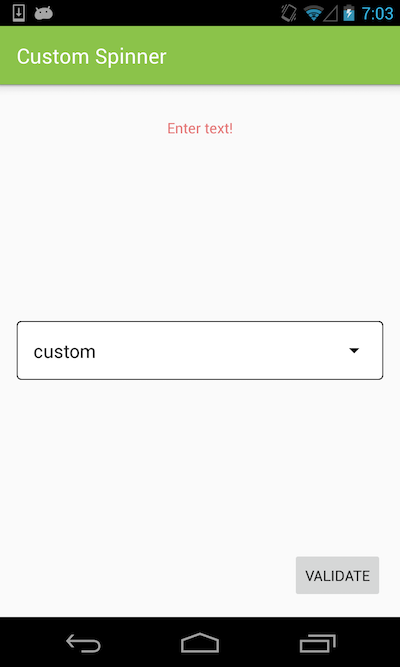

# CustomSpinnerExample

Spinner view with few adjustments:
  - custom border
  - empty item by default
  - enter custom text (last item)

    

View implementation: [CompoundSpinner.java](https://github.com/ysered/CustomSpinnerExample/blob/master/app/src/main/java/com/ysered/customspinnerexample/view/CompoundSpinner.java)
